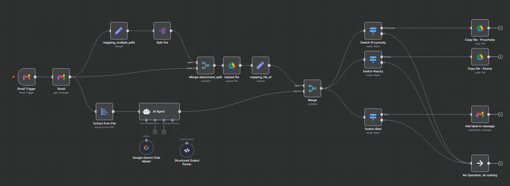

# Automatyczna klasyfikacja faktur z wykorzystaniem AI

Projekt przedstawia kompletny system automatyzujący obsługę faktur otrzymywanych e-mailem.  
Workflow został przygotowany w środowisku **n8n** i wykorzystuje **sztuczną inteligencję (Gemini / OpenAI)** do rozpoznawania rodzaju faktury.



---

##  Opis działania

System automatycznie przetwarza wiadomości e-mail z załączonymi fakturami PDF i przypisuje je do odpowiednich kategorii na Dysku Google.  
Działa całkowicie samodzielnie – bez konieczności ręcznego pobierania, analizowania i sortowania plików.

###  Etapy działania

1. **Odbiór wiadomości e-mail**  
   System monitoruje skrzynkę Gmail i automatycznie reaguje, gdy pojawi się nowa wiadomość z załącznikiem PDF.

2. **Odczyt treści faktury**  
   Załączony plik PDF jest odczytywany przez moduł OCR i przekształcany w tekst do dalszej analizy.

3. **Analiza przez AI**  
   Model językowy analizuje treść dokumentu, rozpoznając, czy jest to:  
   - faktura sprzedaży (**Przychody**)  
   - faktura zakupu (**Koszty**)  
   Jeśli dokument nie może zostać jednoznacznie sklasyfikowany, oznaczany jest jako **Błąd (Blad)**.  
   W tym kroku system odczytuje także **datę wystawienia** faktury.

4. **Zapis na Dysku Google**  
   W zależności od klasyfikacji, plik PDF zostaje zapisany w odpowiednim folderze:  
   - `/Przychody`  
   - `/Koszty`  
   Nazwa pliku zawiera datę wystawienia, co ułatwia późniejsze wyszukiwanie.

5. **Etykietowanie wiadomości e-mail**  
   Jeśli system nie rozpozna typu dokumentu, wiadomość w Gmailu zostaje automatycznie oznaczona etykietą, aby użytkownik mógł ją ręcznie zweryfikować.

---

## Korzyści

- **Pełna automatyzacja obiegu faktur** – od e-maila po zapis w odpowiednim folderze.  
- **Minimalizacja pracy ręcznej** i ryzyka błędów przy sortowaniu.  
- **Szybki dostęp** do faktur uporządkowanych według kategorii i dat.  
- **Łatwiejsze rozliczenia** i lepszy porządek w dokumentach finansowych.

---

## Uruchomienie projektu

### Wymagania
- Zainstalowany **Docker** i **Docker Compose**
- Konto Google z dostępem do Gmail i Google Drive (do konfiguracji połączeń)
- Klucz API do modelu AI (Gemini / OpenAI)

---

#### 1 - Sklonuj repozytorium
```bash
git clone https://github.com/zacky111/n8n_invoices_categorization.git
cd n8n_invoices_categorization
```


#### 2 - Uruchom kontener n8n
```powershell
docker compose up -d
```
Aplikacja będzie dostępna pod adresem:
http://localhost:5678

#### 3 - Import pliku workflow
- Otwórz n8n w przeglądarce.
- Utwórz nowy workflow (przycisk "+" w prawym górnym rogu interfejsu użytkownika).
- Kliknij *Import workflow*.
- Wskaż plik: `workflow_task_invoices.json`.

#### 4 - Uruchomienie workflow
- należy w zakładce *Credentials* uzupełnić uwierzytelnianie dla:
    - Gmail (Gmail OAuth2 API),
    - Google Drive (Google Drive OAuth2 API),
    - Google Gemini (Google Gemini(PaLM) Api).
- po uzupełnieniu, wystarczy zapisać workflow i nacisnąć przycisk *Active*.

---
## Bezpieczeństwo
Dane logowania (Gmail, Google Drive, AI) są przechowywane lokalnie w bazie n8n (database.sqlite) i **nie są częścią repozytorium**. Plik ten zostanie utworzony przy pierwszym uruchomieniu konteneru.

Plik .gitignore wyklucza wszelkie poufne dane, logi i ustawienia środowiska.